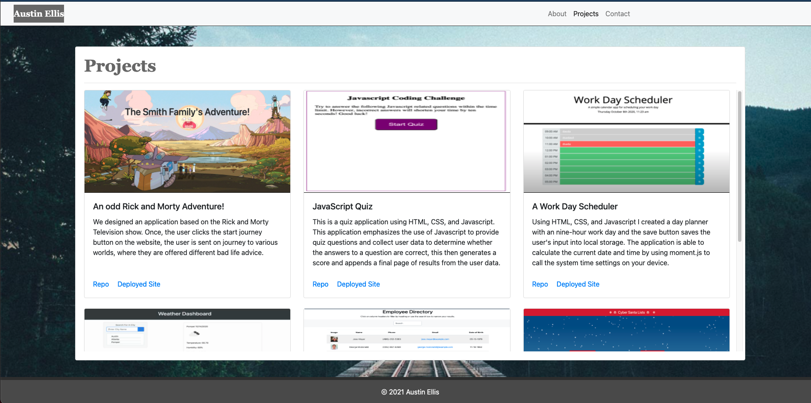
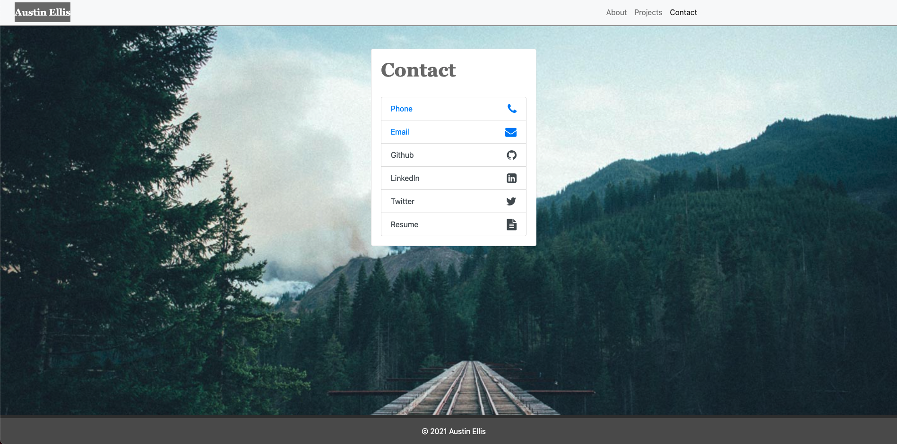

# React-Portfolio

    

## Description

A ReactJS refactor of my Portfolio. I created a portfolio using React because I want to set myself apart from other developers whose portfolios do not use some of the latest technologies.

## Table of Contents

- [Description](#description)
- [Acceptance-Criteria](#acceptance-criteria)
- [Preview](#preview)
- [License](#license)

## Acceptance Criteria

- Updated portfolio featuring 6 total projects

- Use React

- A `Header` component that appears on multiple pages

- A single `Project` component that will be used multiple times on a single page

- Navigation with React Router, dynamic rendering, or another third part router

- A `Footer` component that appears on multiple pages

- Update GitHub profile with pinned repositories featuring those same projects

- Deploy this site to GitHub Pages using the [Create React App docs for deployment.](https://create-react-app.dev/docs/deployment/#github-pages)

## Preview

## License

MIT License

Copyright (c) 2021 Austin Ellis

Permission is hereby granted, free of charge, to any person obtaining a copy
of this software and associated documentation files (the "Software"), to deal
in the Software without restriction, including without limitation the rights
to use, copy, modify, merge, publish, distribute, sublicense, and/or sell
copies of the Software, and to permit persons to whom the Software is
furnished to do so, subject to the following conditions:

The above copyright notice and this permission notice shall be included in all
copies or substantial portions of the Software.

THE SOFTWARE IS PROVIDED "AS IS", WITHOUT WARRANTY OF ANY KIND, EXPRESS OR
IMPLIED, INCLUDING BUT NOT LIMITED TO THE WARRANTIES OF MERCHANTABILITY,
FITNESS FOR A PARTICULAR PURPOSE AND NONINFRINGEMENT. IN NO EVENT SHALL THE
AUTHORS OR COPYRIGHT HOLDERS BE LIABLE FOR ANY CLAIM, DAMAGES OR OTHER
LIABILITY, WHETHER IN AN ACTION OF CONTRACT, TORT OR OTHERWISE, ARISING FROM,
OUT OF OR IN CONNECTION WITH THE SOFTWARE OR THE USE OR OTHER DEALINGS IN THE
SOFTWARE.
